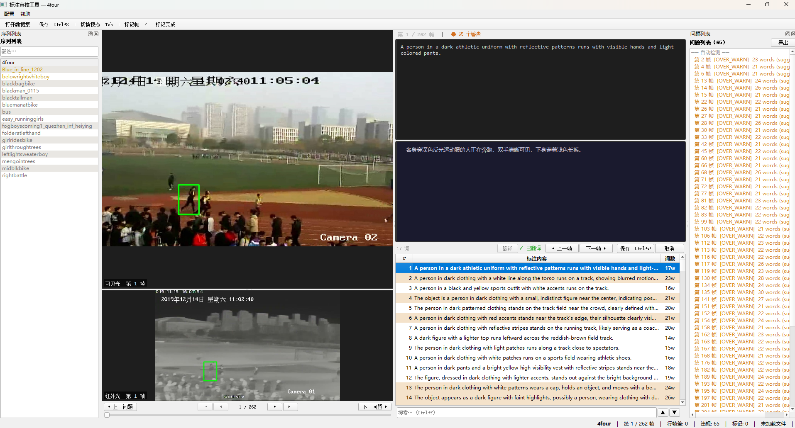

# AnnotationCheck — 标注审核工具

> 双模态（可见光 + 红外光）图像序列标注审核工具，支持逐帧对照文本编辑、违规自动检测与问题标记，欢迎Star和PR🎉



---

## 目录

1. [数据组织格式](#1-数据组织格式)
2. [环境配置](#2-环境配置)
3. [启动方式](#3-启动方式)
4. [界面布局](#4-界面布局)
5. [核心操作流程](#5-核心操作流程)
6. [编辑与保存逻辑](#6-编辑与保存逻辑)
7. [备份机制](#7-备份机制)
8. [违规自动检测](#8-违规自动检测)
9. [问题帧标记](#9-问题帧标记)
10. [审核进度管理](#10-审核进度管理)
11. [快捷键参考](#11-快捷键参考)
12. [文件结构](#12-文件结构)
13. [阿里云翻译功能](#13-阿里云翻译功能)
14. [常见问题](#14-常见问题)

---

## 1. 数据组织格式

### 目录结构

```
data/
├── visual/                          # 图像数据（由 ZIP 包解压而来）
│   └── {序列名}/                    # 序列目录
│       ├── visible/                 # 可见光图像：v000001.jpg, v000002.jpg ...
│       └── infrared/               # 红外光图像：i000001.jpg, i000002.jpg ...
│
├── text/                            # 文本标注（与图像序列一一对应）
│   ├── {序列名}.txt                 # 每行对应一帧，与 visible/infrared 帧数严格对应
│   ├── backup/                     # 自动备份（每序列最多保留 10 份）
│   │   └── {序列名}/
│   │       └── {序列名}_20260414_153022.txt   # 时间戳备份
│   └── translations/               # 译文缓存（自动生成）
│       └── {序列名}_translations.json          # 各帧译文，格式 {帧序号: "译文"}
│
└── review/                         # 审核状态记录
    ├── progress.json                # 所有序列的审核进度
    └── {序列名}_flags.json          # 该序列的问题帧标记
```

### 文件命名规则

| 类型 | 命名格式 | 示例 |
|------|----------|------|
| 可见光帧 | `v` + 6 位序号 | `v000001.jpg` |
| 红外帧 | `i` + 6 位序号 | `i000001.jpg` |
| 文本标注 | 序列名 `.txt` | `bus.txt` |
| 图像序列目录 | 二级同名目录 | `bus/bus/` |

### 文本标注格式

- 编码：`UTF-8`
- 换行：`Unix LF`（`\n`），末行无末尾换行符
- 每行对应一帧，`read().splitlines()` 解析，行号从 1 开始（帧号从 1 开始）
- 标注内容要求：
  - 标准长度 ≤ 20 词，建议不超过 30 词（绝对上限）
  - 纯英文，禁止中英混杂
  - 相邻帧描述不得完全相同
  - 不得含乱码字符

---

## 2. 环境配置

### 依赖

| 库 | 版本要求 | 说明 |
|----|---------|------|
| Python | ≥ 3.8 | 推荐 3.9 |
| PyQt5 | ≥ 5.15 | GUI 框架 |
| Pillow | ≥ 9.0 | 图像解码（绕过 Qt JPEG 插件问题）|
| natsort | ≥ 8.4 | 自然排序（文件名 1, 2, 10 正确排列）|
| alibabacloud_alimt20181012 | = 1.1.0 | 阿里云机器翻译 SDK |

### 安装

```bash
# 激活 conda 环境
conda activate p39

# 安装依赖
pip install PyQt5==5.15.7 Pillow==9.5.0 natsort==8.4.0 alibabacloud_alimt20181012==1.1.0
```

> **注意**：本项目使用的 conda 环境 `p39` 中 PyQt5 缺少内置 JPEG 解码插件，
> 程序通过 Pillow 解码图像并转换为 Qt 可处理的格式，完全不依赖 Qt 的 JPEG 插件，
> 在任何环境下均可正常运行。

---

## 3. 启动方式

### 方式一：直接运行源码（开发/调试用）

```bash
conda activate p39
cd 项目根目录
python main.py
```

### 方式二：运行打包后的 exe（推荐最终用户使用）

```
dist/AnnotationCheck.exe   ← 双击直接运行，无需安装 Python 环境
```

> 打包版本已将 conda Qt 运行时 DLL 和插件目录嵌入 exe，单文件分发，无需任何依赖。

---

## 4. 界面布局

```
┌──────────────────────────────────────────────────────────────────────────┐
│  菜单栏：文件  视图  编辑  工具  帮助                                       │
├──────────────────────────────────────────────────────────────────────────┤
│  [打开数据集] [保存] │ [切换模态 Tab] │ [|◀][◀]  47/113  [▶][▶|] │ [标记帧 F] │
├────────────┬─────────────────────────────┬───────────────────────────────┤
│            │                              │  标注审核工具 — bus             │
│  序列列表   │    可见光（主/大窗格）       │  第 47 / 113 帧   │  ● 3 个错误 │
│            │                              │                               │
│  ● bus    │  [图像帧号徽章]               │  ┌─────────────────────────┐  │
│  ● black  │                              │  │  当前帧标注预览（大窗格） │  │
│    bagbike│                              │  │  A person in white...  │  │
│  ⚠ 4four  │─────────────────────────────── │  │  21 词  [◀ 上一帧][下一帧▶]│  │
│            │    红外光（次/小窗格）        │  │  [保存 Ctrl+↵] [取消]  │  │
│  [筛选…]  │                              │  └─────────────────────────┘  │
│            │                              │                               │
│            │                              │  # │ 标注内容            │词数│  │
│            │                              │ 45 │ A person in white… │ 8w │  │
├────────────┴─────────────────────────────┤  46 │ A person in a whit…│22w │  │
│  状态栏: bus  │  第 47/113 帧 │  违规: 3 │  47 │ The bus is large…  │31w │  │
│  │ 行帧差: 0 │  标记: 2  │  已保存 ✓     │                             │
└──────────────────────────────────────────────────────────────────────────┘
```

### 四大区域说明

| 区域 | 位置 | 说明 |
|------|------|------|
| **工具栏** | 顶部 | 打开数据集、保存、切换模态、标记帧 |
| **序列列表** | 左侧停靠栏 | 所有序列列表，支持按名称过滤，双击进入 |
| **图像窗格** | 左侧中央 | 上部大窗格=主模态，下部小窗格=次模态，`Tab` 键一键切换 |
| **标注窗格** | 右侧 | 顶部大预览框（可编辑当前帧）+ 下方表格（浏览全部帧）|
| **问题列表** | 右侧停靠栏 | 手动标记 + 自动检测到的违规，双击跳转 |

---

## 5. 核心操作流程

### 5.1 加载数据集

1. 点击工具栏「**打开数据集**」
2. 在弹出的目录选择框中选择 **`data/` 目录**（包含 `visual/` 和 `text/` 子目录的那个）
3. 左侧「序列列表」自动填充所有序列
4. 双击序列名（如 `bus`）进入审核

> 程序会自动检测：
> - 可见光帧数 vs 红外帧数是否一致（不一致时弹出警告）
> - 文本行数 vs 图像帧数是否一致（不一致时状态栏红色提示）

### 5.2 逐帧浏览

- **键盘**：`←` / `→`（或 `A` / `D`）逐帧切换；`Ctrl+←` / `Ctrl+→` 跳 10 帧
- **鼠标**：拖动进度滑块实时预览
- **点击**：直接点击右侧表格任意行，跳转到对应帧
- **跳转**：帧号输入框直接输入帧号回车跳转

### 5.3 查看标注

当前帧的标注自动显示在右侧顶部的**大预览框**中，包括：
- 完整标注文本（可完整阅读所有字符）
- 词数统计（实时更新）
- 左侧彩色边框颜色表示违规级别（见下节）

下方表格可快速浏览全部帧，违规行自动着色：
| 颜色 | 含义 |
|------|------|
| 红色背景 | 超出 30 词上限（错误）|
| 橙色背景 | 超出 20 词建议值（警告）|
| 蓝色背景 | 与相邻帧完全重复（错误）|
| 黄色背景 | 与相邻帧高度相似（>90%，警告）|
| 紫色背景 | 含中文字符或乱码（错误）|
| 蓝色边框（当前帧）| 当前正在审核的帧 |

---

## 6. 编辑与保存逻辑

### 6.1 编辑流程

1. 在顶部预览框中直接修改文本
2. 词数实时显示，超过限制自动变色
3. 点击「**保存 Ctrl+↵**」或按 `Ctrl+Enter` 保存当前帧
4. 状态栏短暂显示「已保存 ✓」

### 6.2 撤销与重做

- `Ctrl+Z` 撤销（最多保留 50 步历史）
- `Ctrl+Y` 重做

### 6.3 保存时机

| 操作 | 是否保存 |
|------|---------|
| `Ctrl+S` / 保存按钮 | 立即保存 |
| `Ctrl+Enter`（预览框）| 保存当前帧 |
| 切换序列 | 弹出确认框（保存 / 放弃 / 取消）|
| 每 3 分钟（自动保存）| 静默保存主文件（不产生新备份）|
| 程序退出 | 自动保存 + 记录审核进度 |

### 6.4 写回文件格式

保存时严格还原原始格式（`UTF-8`，`\n` 分隔，末行无末尾换行），
与原始标注文件格式完全一致，不会引入额外换行符。

---

## 7. 备份机制

每次手动保存时，程序自动在以下位置创建时间戳备份：

```
data/text/backup/{序列名}/{序列名}_20260414_153022.txt
```

- 每个序列最多保留 **10 个**最新备份
- 自动清理超出配额的旧版本
- 自动保存不产生新备份（仅覆写主文件）
- 备份文件为完整文本内容，非增量

---

## 8. 违规自动检测

程序在加载序列时对全部帧执行一次违规扫描，结果缓存并实时更新。

### 检测项目

| 违规类型 | 级别 | 检测方式 | 规范依据 |
|----------|------|----------|----------|
| 超出上限 | 错误 | 词数 > 30 | 标注长度规范 |
| 超出建议值 | 警告 | 词数 > 20 且 ≤ 30 | 标注长度规范 |
| 完全重复 | 错误 | 与相邻帧逐字比较 | 多样性规范 |
| 高度相似 | 警告 | 与相邻帧相似度 > 90% | 多样性规范 |
| 语言混杂 | 错误 | 正则检测中文字符 / 乱码 | 语言纯净规范 |

> **注意**：幻觉（HALLUCINATION）、语法错误（GRAMMAR）、视觉不准确（VISUAL）
> 属于需要人工判断的违规类型，程序无法自动检测，请在审核过程中手动标记。

---

## 9. 问题帧标记

### 标记方式

按 `F` 键或工具栏「标记帧」按钮，弹出问题类型选择框：

| 类型 | 含义 |
|------|------|
| 幻觉（HALLUCINATION）| 标注描述了图像中不存在的内容 |
| 语法错误（GRAMMAR）| 拼写 / 时态 / 冠词等语法问题 |
| 视觉不准确（VISUAL）| 目标 / 颜色 / 动作与图像不符 |
| 其他（OTHER）| 其他类型问题 |

支持填写备注。

### 查看与管理

- 右侧「问题列表」停靠栏显示所有手动标记 + 自动检测违规
- 双击任意条目跳转到对应帧
- 点击「导出」可输出 JSON 问题报告

---

## 10. 审核进度管理

程序自动维护 `data/review/progress.json`，记录每个序列的：
- **审核状态**：`pending`（未开始）/ `in_progress`（进行中）/ `done`（已完成）
- **最后审核帧号**：下次打开自动从该帧继续
- **违规数量 / 手动标记数量**
- **完成时间**

点击工具栏「标记完成」可将序列标为已完成（需先处理所有错误级违规）。

---

## 11. 快捷键参考

### 导航

| 快捷键 | 功能 |
|--------|------|
| `←` / `A` | 上一帧 |
| `→` / `D` | 下一帧 |
| `Ctrl+←` | 跳回 10 帧 |
| `Ctrl+→` | 跳进 10 帧 |
| `Home` | 跳到第 1 帧 |
| `End` | 跳到末帧 |
| `Ctrl+F` | 聚焦搜索框 |

### 编辑

| 快捷键 | 功能 |
|--------|------|
| `Ctrl+S` | 保存当前标注 |
| `Ctrl+Z` | 撤销 |
| `Ctrl+Y` | 重做 |
| `Ctrl+Enter` | 在预览框中保存当前帧 |
| `Ctrl+[` | 跳转到上一问题帧 |
| `Ctrl+]` | 跳转到下一问题帧 |

### 查看

| 快捷键 | 功能 |
|--------|------|
| `Tab` | 切换主显示模态（可见光 ↔ 红外光）|
| `F` | 标记 / 取消标记当前帧 |
| `[` | 跳转到上一个手动标记帧 |
| `]` | 跳转到下一个手动标记帧 |

### 图像操作（鼠标）

| 操作 | 功能 |
|------|------|
| `Ctrl + 滚轮` | 缩放图像 |
| 按住左键拖拽 | 平移图像 |
| 双击图像 | 全屏预览 |

### 翻译

| 快捷键 | 功能 |
|--------|------|
| `翻译` 按钮 | 手动重新翻译当前帧（文本修改后需点击）|

---

## 12. 文件结构

```
AnnotationCheck/
├── main.py                      # 程序入口，DLL 路径配置
│
├── core/                        # 核心业务逻辑
│   ├── config_manager.py        # 用户配置持久化（JSON，含阿里云 AK/SK）
│   ├── sequence_loader.py       # 序列扫描与路径解析
│   ├── annotation_manager.py    # 标注读写、撤销/重做、备份、译文持久化
│   ├── annotation_validator.py  # 违规检测引擎
│   ├── image_loader.py          # Pillow 解码 → QPixmap（跨平台图像加载）
│   └── review_manager.py        # 问题帧标记、审核进度持久化
│
├── ui/                          # GUI 界面
│   ├── main_window.py           # 主窗口，布局编排，信号总线，菜单栏
│   ├── image_panel.py           # 双模态图像窗格（缩放/平移/全屏）
│   ├── nav_bar.py               # 帧导航栏
│   ├── text_panel.py            # 标注预览框 + 译文显示框 + 表格 + 搜索
│   ├── sequence_panel.py        # 序列列表侧边栏
│   ├── flag_panel.py            # 问题帧汇总面板
│   └── flag_dialog.py           # 标记问题帧类型对话框
│
├── resources/
│   └── icons/
│       └── bitbug_favicon.ico   # 应用图标
│
├── dist/
│   └── AnnotationCheck.exe       # 打包后的可执行文件（单文件，~795MB）
│
├── config.json                  # 用户配置（自动生成，含 SDK 凭证）
├── requirements.txt             # Python 依赖列表
├── DESIGN.md                   # 技术设计文档
└── README.md                   # 本文档
```

---

## 13. 阿里云翻译功能

> 程序集成阿里云机器翻译 SDK，可在审核过程中实时查看英文标注的中文译文，
> 无需手动复制粘贴。所有译文自动缓存，关闭或切换序列后依然有效。

### 开通翻译功能

阿里云翻译功能需要自行注册阿里云账号，访问 https://mt.console.aliyun.com/basic 可以开通**机翻翻译通用版**，每个主账号每月有一百万字符的免费额度，
**1,000,000字符约160,000英文单词，使用时请注意额度限制，避免大量计费！！！**
注册后可以通过 SDK 使用软件内翻译功能。

### 13.1 首次配置

首次启动应用时，会自动弹出 **阿里云 SDK 凭证配置** 对话框。

如果需要手动配置或修改：
- 菜单栏 → **配置** → **阿里云 SDK 设置…**
- 输入 Access Key ID 和 Access Key Secret
- 点击确定保存

获取凭证地址：https://ram.console.aliyun.com/manage/ak

> **注意**：凭证保存在 `config.json` 中（程序同级目录），请勿泄露给他人。

### 13.2 界面说明

右侧标注面板分为两个区域：

| 区域 | 位置 | 说明 |
|------|------|------|
| **英文标注编辑框** | 上方（约25%高度）| 可编辑的原始英文标注，Consolas 等宽字体，左边框颜色表示违规级别 |
| **中文译文显示框** | 下方（约25%高度）| 只读，深蓝背景，雅黑字体，显示当前帧的自动翻译结果 |

控制行中的 **[翻译]** 按钮用于手动重新翻译（文本修改后必须点击）。

### 13.3 自动翻译机制

- **翻页触发**：每次跳转到新帧，自动对当前帧发起翻译请求
- **语言检测**：程序自动判断标注语言（含中文 → 英译，含其他字符 → 中译）
- **预取缓存**：同时在后台预取 ±1、±2、±3 相邻帧的译文，存入内存缓存
- **译文持久化**：每次翻译结果实时写入 `data/text/translations/{序列名}_translations.json`，下次打开该序列时自动恢复缓存，无需重复调用 API
- **非阻塞**：所有翻译请求均在后台线程执行，不影响窗口响应

### 13.4 手动重新翻译

修改英文标注后，需要点击 **[翻译]** 按钮手动重新翻译当前帧（因为自动翻译仅在翻页时触发，不会主动重新翻译已缓存的内容）。

状态标签含义：

| 状态 | 颜色 | 含义 |
|------|------|------|
| ✓ 已翻译 | 绿色 | 译文已缓存并显示 |
| 翻译中… | 灰色 | API 请求进行中 |
| 翻译失败 | 红色 | 认证失败或网络错误，请检查 SDK 配置 |
| 未配置 SDK | 红色 | 尚未填写 AK/SK，请通过菜单配置 |

### 13.5 译文文件格式

`data/text/translations/{序列名}_translations.json` 结构：

```json
{
  "0": "一个人穿着白色上衣和深色裤子走在人行道上。",
  "1": "A bus is driving on the road.",
  "2": "..."
}
```

- Key：帧序号（从 0 开始）
- Value：该帧标注的译文
- 手动修改可能导致覆盖，以程序保存为准

---

## 14. 常见问题

### Q1：打开数据集后图像显示为黑色
确认选择的是 `data/` 目录（含 `visual/` 和 `text/` 子目录）。
如果 exe 在没有 conda 环境的机器上运行，图像加载不依赖 Qt JPEG 插件，
由 Pillow 负责解码，不会出现黑色问题。

### Q2：标注文件与图像帧数不一致
程序会在状态栏显示行帧差（红色），并允许正常浏览和编辑。
请在审核后联系项目负责人处理源头数据。

### Q3：如何恢复误改的标注？
`data/text/backup/{序列名}/` 目录下有每次保存的时间戳备份，
手动将备份文件内容复制到主文件即可。

### Q4：程序异常退出，未保存的修改会丢失吗？
程序退出前自动保存当前状态，审核进度（最后帧号）也会持久化。
但两次自动保存（间隔 3 分钟）之间的修改可能丢失，建议每隔几分钟手动保存一次。

### Q5：序列列表没有显示序列？
请确认选择的目录包含 `data/visual/` 子目录。
程序会自动扫描该子目录下的所有子目录作为序列列表。

### Q6：打包 exe 分发时需要安装 Python 吗？
不需要。`dist/AnnotationCheck.exe` 是单文件打包，已内嵌 Python 解释器和全部依赖，
可直接在目标机器双击运行，无需安装任何环境。
